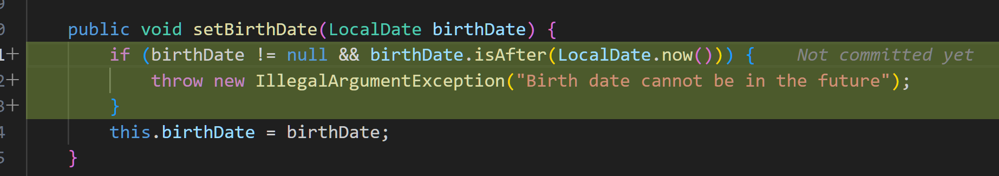
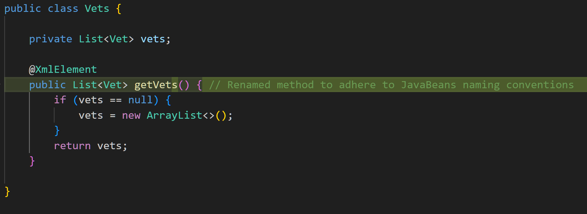
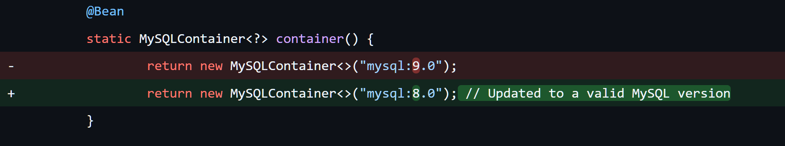

# batchai - A supplement to Copilot and Cursor - utilizes AI for batch processing of project codes

[中文](./README_cn.md)

`batchai` has a simple goal: run a command to scan and process an entire codebase, letting AI perform bulk tasks like automatically finding and fixing common bugs, or generating unit tests. It’s similar to AI-driven SonarQube for error checking. Essentially, batchai complements tools like Copilot and Cursor by eliminating the need to copy-paste between chat windows and open files, or manually adding files to the AI’s context, making the process more efficient.

To demonstrate with the `spring-petclinic` project (cloned from https://github.com/spring-projects/spring-petclinic), I ran the following `batchai` command in the cloned directory:

  ```shell
  batchai check --fix
  ```

And here are the results I got:


That's why I created `batchai`. The idea is simple: less copy-pasting, fewer clicks on 'Add to Chat' or 'Apply.' `batchai` traverses files and processing each of them. Since AI isn’t always perfect, I’ve designed it to run only on a Git directory, so we can easily diff the changes and choose to either commit or revert them.

Currently, `batchai` only supports code check and fixing common issues (think of it as a local AI-driven SonarQube). The next feature in progress is generating unit test code in batches, which I plan to use in a few of my personal projects (including this `batchai`), as they have very few unit tests. Other planned features include code explanation, comment generation, and refactoring — all of which will be handled in batches. Additionally, I’m working on enabling `batchai` to have an overall insight of the project’s code, such as building cross-file code symbol indexing, which should help the AI perform better.

Here are some interesting findings from testing batchai on my personal projects over the past two weeks:

- It can identify issues that traditional tools, such as SonarQube, tend to miss.
- It may not report all issues in one go, so I need to run it multiple times.
- Due to outdated LLM training data and hallucinations, it's crucial to confirm the changes for accuracy by myself - That's why I make `batchai` work only on clean Git repository directories.

I used the [spring-petclinic (cloned from https://github.com/spring-projects/spring-petclinic)](https://github.com/qiangyt/spring-petclinic) for demonstration.

Here are some examples of correct check:

- [Adds a check to ensure birthday not be in the future](https://github.com/qiangyt/spring-petclinic/commit/6f42f16a249b3fffa8b95ac625c824210bbb2712#diff-7ba90c8df45063ea6569e3ea29850f6dbd777bc14f76b1115f556ade61441207)

<p align="center">
  
</p>

- [Renamed method to adhere to JavaBeans naming conventions](https://github.com/qiangyt/spring-petclinic/commit/6f42f16a249b3fffa8b95ac625c824210bbb2712#diff-4788251011337c19f735f2061cf599b8dbc0394a92ba86447b0db9b386f869cd)

<p align="center">
  
</p>

The full results are as follows:

- [Code Check report](https://github.com/qiangyt/spring-petclinic/commit/5f2770f2fc0ce4e5d59e2ae348ce0b14c8767e75)

- [Fix following the check report](https://github.com/qiangyt/spring-petclinic/commit/6f42f16a249b3fffa8b95ac625c824210bbb2712)

The results above were generated by running `batchai` with the OpenAI `gpt-4o-mini` model.

Additionally, I’ve just launched a demo website (https://example.batchai.kailash.cloud:8443), where you can submit your own GitHub repositories for `batchai` to perform bulk code checks and generate unit test codes. Given the high cost of using OpenAI, this demo site uses the open-source model `qwen2.5-coder:7b-instruct-fp16`（performs not as good as `gpt-4o-mini`）, running on my own `Ollama` instance. Note that due to resource limitations, tasks will be executed in a queue.

Here are some interesting findings from eat-my-dog on my own projects over the past few weeks:

- AI often detects issues that traditional tools (like SonarQube) might miss, and it can fix them directly.

- The AI doesn’t report all issues at once, so I need to run it multiple times to catch everything.

Also, here’s an example of where the AI didn’t quite get it right:

- [Downgraded MySQL version from 9.0 back to 8.0 (gpt4o-mini think latest MySQL version is 8.0)](https://github.com/qiangyt/spring-petclinic/commit/6f42f16a249b3fffa8b95ac625c824210bbb2712#diff-7bc3b8001f97e9913dec25d48040a4a71b2ff4fcf915b49325602b4facad5979)

<p align="center">
  
</p>

The issue of LLM hallucinations is unavoidable, so to prevent AI errors from overwriting our existing changes, I designed `batchai` to only work in a clean Git repository. If there are any unstaged files, `batchai` will refuse to execute. This way, we can use `git diff` to confirm the changes made by `batchai`. If there are mistakes, we can simply revert them. This step is still essential.

## Features

- [x] Batch Code Check : Reports issues to the console, saves as a check report, and then optionally fixes code directly.
- [x] Batch Test Code Generation
- [x] Customized Prompts.
- [x] File Ignoring : Specifies files to ignore, respecting both `.gitignore` and an additional `.batchai_ignore` file.
- [x] Target Specification : Allows specifying target directories and files within the Git repository.
- [x] Implemented using Go: Resulting in a single executable binary that works on Mac OSX, Linux, and Windows.
- [x] Diff: Displays colorized diffs in the console.
- [x] LLM Support : Supports OpenAI-compatible LLMs, including Ollama.
- [x] I18N : Supports internationalization comment/explaination generation.

## Planned features

Currently, `batchai` only supports bulk code checks and generating unit test code, but planned features include code explanation and comment generation, refactoring, and more — all to be handled in bulk. Another goal is to give batchai a broader understanding of the project by building a cross-file code symbol index, which should help the AI work more effectively.

Of course, suggestions and feature requests are always welcome at the [Issues](https://github.com/qiangyt/batchai/issues) page. Feel free to contribute, and we can discuss them together.

## Getting Started

1. Download the latest executable binary from [here](https://github.com/qiangyt/batchai/releases/latest) and add it to your $PATH. For Linux and Mac OSX, remember to run `chmod +x ...` to make the binary executable.

2. Clone the demo project. The following steps assume the cloned project directory is `/data/spring-petclinic`

   ```shell
   cd /data
   git clone https://github.com/spring-projects/spring-petclinic
   cd spring-petclinic
   ```

   In this directory, create a .env file. In the .env file, set the OPENAI_API_KEY. Below is an example:
  
   ```shell
   OPENAI_API_KEY=change-it
   ```

   For Ollama, you can refer to my example [docker-compose.yml](./docker-compose.yml)

3. CLI Examples:

   - Report issues to the console (also saved to `build/batchai`):

   ```shell
   cd /data/spring-petclinic
   batchai check . src/main/java/org/springframework/samples/petclinic/vet/Vets.java
   ```

   - Directly fix the target files via option `--fix`:

   ```shell
   cd /data/spring-petclinic
   batchai check --fix . src/main/java/org/springframework/samples/petclinic/vet/Vets.java
   ```

   - Run `batchai` in main Java code only:

   ```shell
   cd /data/spring-petclinic
   batchai check . src/main/java/
   ```

   - Run `batchai` on the entire project:

   ```shell
   cd /data/spring-petclinic
   batchai check .
   ```

   - Generates unit test code for the entire project:

   ```shell
   cd /data/spring-petclinic
   batchai test .
   ```

## Supported LLMs

Tested and supported models:

- OpenAI series: 
  
  - `openai/gpt-4o`
  
  - `openai/gpt-4o-mini`

  Other OpenAI models should work too.

- Ali TONYI Qwen series (also available via Ollama): 
  
  - `qwen2.5-coder-7b-instruct`
  
  - `qwen2.5-coder:7b-instruct-fp16`

  Other Qwen models should work too.
  
To add more LLMs, simply follow the configuration in [res/static/batchai.yaml](res/static/batchai.yaml), as long as the LLM exposes an OpenAI-compatible API.

## Configuration

- Optional configuration file:

  You can provide an optional configuration file: `${HOME}/batchai/batchai.yaml`. For a full example, refer to [res/static/batchai.yaml](res/static/batchai.yaml)

- Environment file:

  You can also configure `batchai` via an environment file `.env` located in the target Git repository directory. Refer to [res/static/batchai.yaml](res/static/batchai.yaml) for all available environment variables, and [res/static/batchai.env](res/static/batchai.env) for their default values.

- Ignore specific files:

  `batchai` ignores the directories and files following `.gitignore` files. This is usually sufficient, but if there are additional files or directories that cannot be ignored by Git but should not be processed by batchai, we can specify them in the `.batchai_ignore` files. The rules are written in the same way as in `.gitignore`.
  
- Customized Prompts
  Refer to `BATCHAI_CHECK_RULE_*` and `MY_CHECK_RULE_*` in [res/static/batchai.yaml]

## License

MIT

## NA

[](https://somsubhra.github.io/github-release-stats/?username=qiangyt&repository=batchai)
